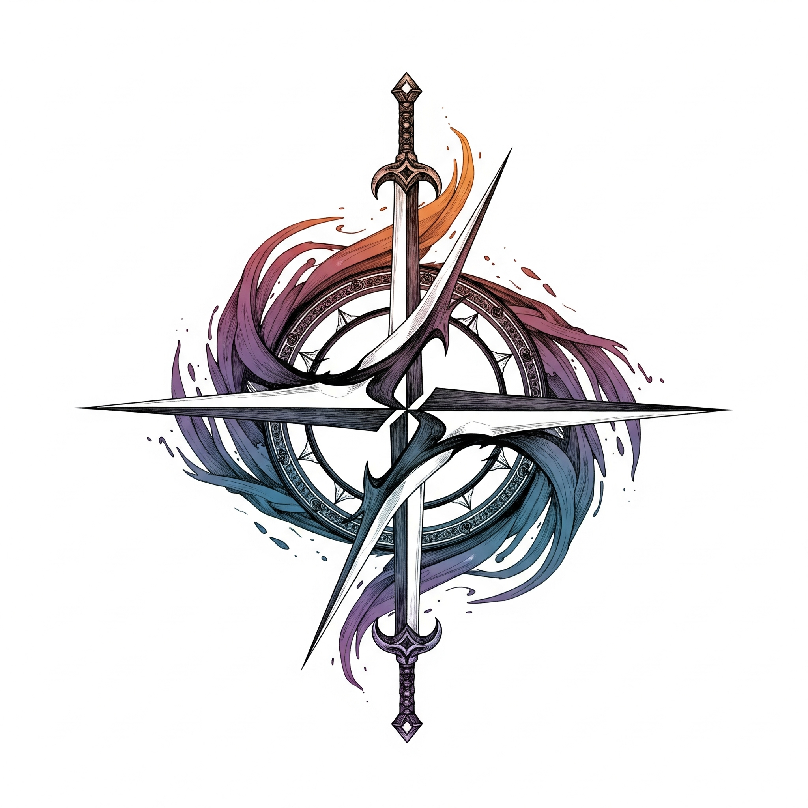

# The Adventurers Guild - For Coders

**Ever read a manga and wished there was an Adventurer's Guild for your own craft? This is it—for coders.**

This open-source project is a digital guild hall where developers can find their next adventure. Instead of slaying slimes, you'll be squashing bugs. Instead of exploring dungeons, you'll be building epic features.
Our Linkedin Page : https://www.linkedin.com/company/adventurers-guild

For Contributers vie the CONTRIUTING.md for the instructions

## How It Works

Just like any guild, we have a structured way for adventurers to prove their worth:

*   **The Quest Board:** This is where you'll find all available tasks. Quests are ranked by difficulty, from E-Rank (simple bug fixes, documentation updates) to S-Rank (major feature implementation, architectural changes).
*   **Form a Party:** Don't want to go it alone? Team up with other developers on a feature branch to tackle more difficult quests together.
*   **Raise Your Rank:** Complete quests to earn experience, build your reputation, and rise through the guild ranks. Your profile on the Guild Roster will display your achievements for all to see.
*   **Earn Your Rewards:** Your reward is tangible: a powerful portfolio, real-world experience, and a legendary contribution graph on GitHub.

## Tech Stack

The guild hall is built with modern, powerful magic (technologies):

*   **Framework:** [Next.js](https://nextjs.org/)
*   **Language:** [TypeScript](https://www.typescriptlang.org/)
*   **Styling:** [Tailwind CSS](https://tailwindcss.com/)
*   **UI Components:** [Shadcn/UI](https://ui.shadcn.com/), [Radix UI](https.radix-ui.com/)
*   **Deployment:** [Vercel](https://vercel.com)

## How to Join the Adventure (Contribute)

**The guild is always looking for new talent.** Whether you're a novice picking up your first code editor or a seasoned archmage, your skills are needed.

1.  **Visit the Quest Board:** Check out the [open issues](https://github.com/your-username/adventurers-guild-website/issues) to find a task that suits your skill level.
2.  **Pick a Quest:** Assign yourself to an issue and announce your intention to take on the quest.
3.  **Forge Your Code:** Create your solution on a new branch.
4.  **Submit Your Work:** Open a Pull Request for the guild elders (maintainers) to review.

Ready to move beyond tutorials and make your mark? Your adventure starts now.
